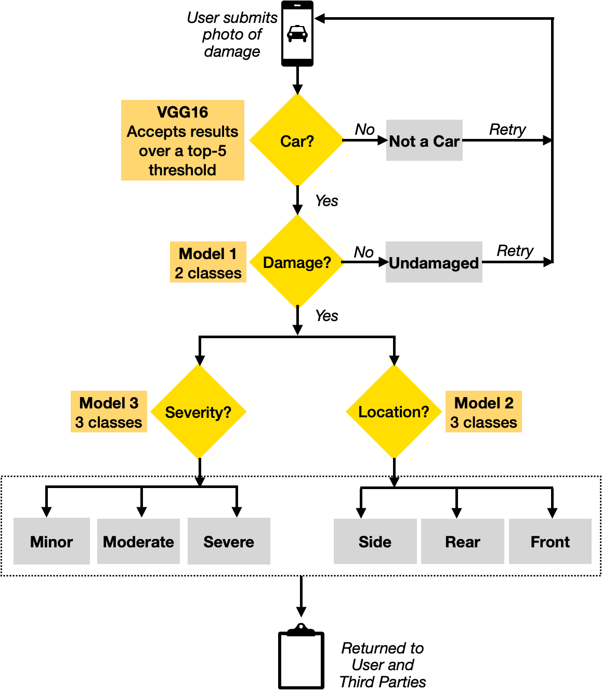

# car-damage-classifier
## Assessing Car Damage with CNNs (Transfer learning with a pretrained VGG16)
Manual estimation of damages in fields like construction, vehicular accidents has been the mainstay of insurance business. However, such methods are replete with biases and inaccurate estimations. The vehicle insurance industry, is characterised by monetary losses owing to the leakage of claims. **Claims leakage** (excluding process inefficiency) could theoretically be reduced to zero with robust logic, complete records, and solid forensics. However, a number of human factors like biases, protection of powerful interest groups creep in during insurance claim settlements, hence there arises a pressing need to automate these processes.

Created a full-fledged pilot project using deep learning and computer vision to facilitate the personal automotive insurance claims process. The approach narrows down to three seperate CNN models pipelined using **Transfer Learning with VGG16 trained on Imagenet Dataset**.

Recognized vehicle possibility, damage location and extent yielding validation accuracies of **87%, 70% and 65%** respectively, avoiding human bias. These can be further improved by incorporating the **on the fly data augmentation** techniques.

Credit for the Dataset goes to [Ting Neo](https://github.com/neokt/car-damage-detective)'s fantastic Damage Classification project.
